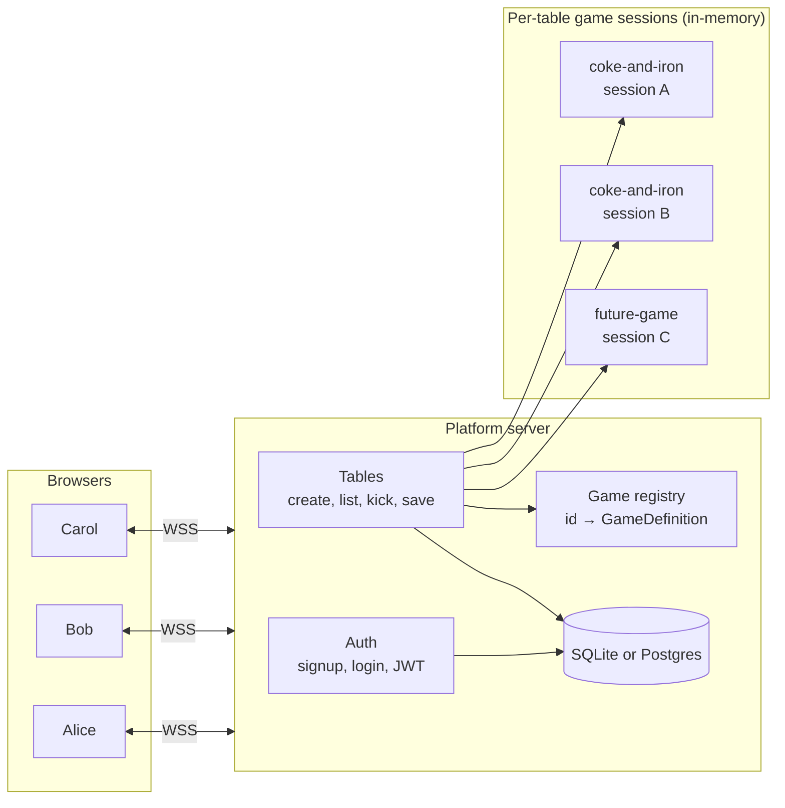
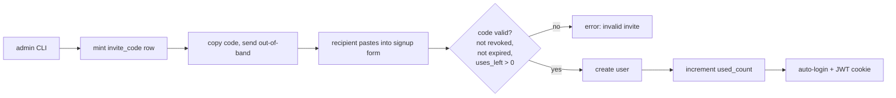
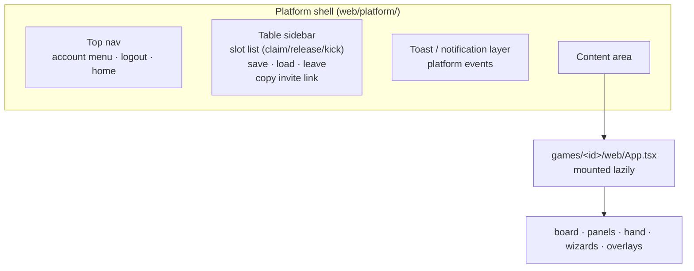
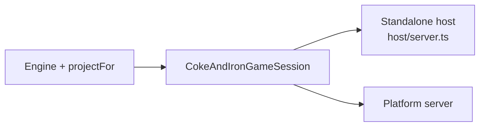

# In My Pocket — design notes

The architecture for **In My Pocket**, a platform that hosts multiple
board games behind a shared account / lobby / save system. The first
registered game is **Coke and Iron** (the Brass Birmingham
implementation, in its own repo). New games plug in via a single
interface (`shared/GameDefinition.ts`).

This document captures the architecture, the trade-offs, the database
shape, and a phased rollout. It is the design authority — when this
doc and the code disagree about intent, this doc wins until updated.

---

## 1. Goals

- Users can **sign up / log in** with username + password.
- Once logged in, they can **create a table** for any registered game
  (today: just Coke and Iron).
- A table has **player slots** and **spectator slots**. Anyone logged in
  can claim or release a slot. The host can kick.
- A kicked / departed player's slot can be **reclaimed** by another
  player, who inherits the seat (hand, mat, money — everything).
- Tables can be **saved** and **loaded** from save files associated
  with a user account.
- New games can be added with **minimal platform changes** — ideally
  just registering a new module.
- Brass remains **runnable as a standalone host** (current behaviour)
  AND as a game embedded in the platform. The two share 99% of code.

## 2. Non-goals (for now)

- Email verification, password reset, OAuth, MFA. Username + password
  is enough until people actually rely on it.
- Matchmaking / ELO / ranked play.
- Mobile-first UI (we're desktop-first).
- Tournaments, brackets, scheduled games.
- A REST API for third-party clients. Everything is the WebSocket.

These can come later; designing them in now would yak-shave the
hobby-project sweet spot.

---

## 3. The big picture



Three layers:

1. **Platform server** — the only thing exposed to the internet. Owns
   auth, the table catalogue, and routes messages to/from per-table
   game sessions.
2. **Game sessions** — one in-memory session per active table.
   Implementations live behind the `GameDefinition` plug-in interface.
   Today's `host/HostGame.ts` becomes the Coke-and-Iron implementation.
3. **Persistent storage** — users, tables, saves. Starts as SQLite (one
   file on disk); migrates to Postgres if/when concurrency becomes a
   bottleneck.

The clean cut: the platform never reads game state. It treats every
game's wire payload as opaque bytes. The session never reads platform
state. They communicate through the `GameDefinition` interface (§5).

---

## 4. Layered protocol

The current Brass protocol has lobby + game messages tangled together.
The platform splits them:

```
S2C / C2S (platform-level)
├── Auth: SIGNUP, LOGIN, LOGOUT, ME
├── Tables: CREATE_TABLE, LIST_TABLES, JOIN_TABLE, LEAVE_TABLE,
│           KICK_USER, SAVE_TABLE, LOAD_TABLE, LIST_SAVES
└── Wrapped: GAME_MSG { tableId, payload: <opaque> }
```

The wrapped `GAME_MSG.payload` is exactly today's Brass `ClientMessage`
/ `ServerMessage`. The platform pipes it untouched between the
WebSocket and the session. New games define their own payload schema
without the platform caring.

Why the wrapping matters:
- **Versioning is per-game.** Brass at protocol v2 and a new game at
  protocol v1 coexist. The platform protocol has its own version,
  bumped only when platform messages change.
- **Routing is trivial.** `tableId` selects the session; the session
  ignores the platform envelope.
- **Testing is independent.** A game's session tests don't need the
  platform; the platform's tests don't need a game.

---

## 5. The plug-in seam: `GameDefinition`

This is the single interface every game implements. Sketch:

```ts
// src/platform/GameDefinition.ts
export interface GameDefinition<Save = unknown> {
  /** Stable id used in URLs, table rows, and routing. */
  readonly id: string;                  // "coke-and-iron"
  readonly displayName: string;         // "Coke and Iron"
  readonly minPlayers: number;
  readonly maxPlayers: number;
  readonly supportsSpectators: boolean;

  /** Build a fresh session for a new table. */
  createSession(opts: CreateOpts): GameSession<Save>;

  /** Hydrate a session from a saved blob. */
  loadSession(blob: Save, opts: LoadOpts): GameSession<Save>;
}

export interface GameSession<Save = unknown> {
  // ---- Lobby (pre-start) ----
  claimSeat(userId: string, seatIndex: number, ...): Result;
  releaseSeat(userId: string, seatIndex: number): Result;
  kickSeat(callerUserId: string, seatIndex: number): Result;
  startGame(callerUserId: string): Result;

  // ---- In-game ----
  /** Game-specific intent. The platform passes the raw payload through. */
  handleGameMessage(userId: string, payload: unknown): void;

  // ---- Wire ----
  /** Platform calls this when a user opens a connection to this table. */
  attachConnection(userId: string, send: (msg: unknown) => void): void;
  detachConnection(userId: string): void;

  // ---- Persistence ----
  serialize(): Save;
}
```

**Key constraint:** the session never knows users by `clientId` (a
short-lived socket id). It knows them by **`userId`** (the long-lived
account id). Reconnect across browsers / devices is automatic — same
account = same seat.

**What disappears in the move from `HostGame` to `GameSession`:**
- The CLI-flag config (lives in the table-creation form now).
- The autosave-to-disk timer (the platform owns saves now).
- The seat-token bearer capability (replaced by user identity).

**What stays:**
- Per-recipient `projectFor` redaction.
- Engine ownership of authoritative state.
- The intent / undo / paused state machine.

---

## 6. Platform-level concerns

### 6.1 Auth

Username + password. Standard recipe:

- **Storage:** `users { id, username UNIQUE, passwordHash, createdAt }`.
  Passwords hashed with **bcrypt** (cost ≥ 12) or **argon2id**.
- **Sessions:** **JWT** signed with a server secret, returned in an
  HttpOnly + SameSite=Lax cookie. 7-day expiry, refreshed on activity.
  Stateless — the server doesn't need a session table.
- **Signup validation:** username 3–32 chars, password 8+ chars.
  Rate-limit signup and login per IP to stop dictionary attacks.

This is ~100 lines of code with `bcrypt` + `jose` (or `@fastify/jwt`).
Don't roll your own crypto; do roll your own auth flow.

**Future:** add email/password reset, OAuth, MFA. None of those change
the core model.

### 6.2 Invite-only signup

The platform is private — accounts can only be created by redeeming an
**invite code**. You (the operator) mint codes out-of-band and share
them with people you want to admit.

#### 6.2.1 Why invite codes (vs. alternatives)

| Approach | Verdict |
|---|---|
| **Single-use invite codes (DB-backed)** | **Recommended.** Revocable, auditable, easy to rate-limit. Each code is one row; redemption is a transactional update. Friendly UX (paste a string into a signup form). |
| Signed JWT invites (stateless) | Smaller infra (no DB row), but **non-revocable** without a denylist — if a code leaks, you can't take it back without bumping the signing key (which invalidates *every* outstanding code). Skip. |
| Magic link via email | Requires email infrastructure (SES, Postmark, etc.). Worth it eventually; out of scope for v1. |
| Manual whitelist (admin approves each signup) | Doesn't scale past your closest 5 friends. Skip. |
| OAuth-only ("only people with a Google account I've allowed") | Punts the auth problem to a third party. Reasonable, but loses the "anyone with a code" UX. |

Single-use codes win for hobby-scale operators: simple, revocable, and
the model is obvious to users ("you got an invite code; paste it in").

#### 6.2.2 Code format

- 16 random characters from an unambiguous alphabet (Crockford base32:
  `0-9 A-H J-K M-N P-T V-Z`). Avoids `I/1`, `O/0`, `L/U`.
- Display with dashes for readability: `XQDP-7M3R-K2NV-9TBA`.
- Stored canonically (uppercased, dashes stripped) so users can paste
  in any case / spacing.

16 characters of base32 = 80 bits of entropy — well past
brute-force-resistant for a DB-backed lookup.

#### 6.2.3 Lifecycle



#### 6.2.4 Schema

```sql
CREATE TABLE invite_codes (
  code             TEXT PRIMARY KEY,        -- canonical: uppercase, no dashes
  created_by       TEXT REFERENCES users(id), -- NULL for admin-minted
  created_at       TEXT NOT NULL,
  expires_at       TEXT,                    -- NULL = no expiry
  max_uses         INTEGER NOT NULL DEFAULT 1,
  used_count       INTEGER NOT NULL DEFAULT 0,
  revoked_at       TEXT,                    -- NULL = active
  note             TEXT                     -- free-text label
);

CREATE TABLE invite_redemptions (
  code             TEXT NOT NULL REFERENCES invite_codes(code),
  redeemed_by      TEXT NOT NULL REFERENCES users(id),
  redeemed_at      TEXT NOT NULL,
  ip_address       TEXT,
  PRIMARY KEY (code, redeemed_by)
);
```

The `invite_redemptions` table is technically optional (the
`used_count` column already gates redemption) but it's cheap and gives
you "who used which code" — useful for moderation and revoking
downstream invites if a chain misbehaves.

#### 6.2.5 Operator workflow

A small CLI on the host:

```
$ node platform/cli.js invite mint --uses 1 --note "for alice"
XQDP-7M3R-K2NV-9TBA

$ node platform/cli.js invite mint --uses 5 --expires 2026-12-01 --note "discord raid"
ABCD-EFGH-JKLM-NPQR

$ node platform/cli.js invite list --active
code               uses    expires      note
XQDP-...           0/1     never        for alice
ABCD-...           2/5     2026-12-01   discord raid

$ node platform/cli.js invite revoke XQDP-7M3R-K2NV-9TBA
revoked.
```

The CLI is admin-only — it talks to the DB directly, doesn't go through
the API. Keeps invite minting off the network surface.

#### 6.2.6 User-mintable codes (later)

Once the platform has real users you may want a viral-by-design model
where each user gets N codes to share. Two new columns
(`monthly_invite_budget`, `last_budget_refresh`) on `users` plus an
endpoint that calls the same minting logic with `created_by = req.user.id`.
Cap to a small number (3–5/month) and you'll get organic growth without
losing control.

Don't build this in v1 — single-source admin minting is enough until
you have an actual community.

### 6.3 Tables

```
tables {
  id, gameId, hostUserId, status (lobby|playing|finished|archived),
  createdAt, updatedAt, name, isPrivate, joinCode (nullable),
  saveBlobId (nullable, points to saves.id when loaded from one)
}

table_slots {
  tableId, seatIndex, kind (player|spectator),
  claimedByUserId (nullable),
  metadata (JSON: displayName, pawnColor, etc.)
}
```

The table's `slots` mirror what the game asks for. When a game declares
`maxPlayers = 4` and `supportsSpectators = true`, the platform creates
4 player slots + an unbounded spectator pool.

**Lifecycle:**
- `CREATE_TABLE { gameId, name, isPrivate, options }` — auth-required.
  Creator becomes `hostUserId` and auto-claims slot 0 (or whichever
  the game says is the first seat).
- `JOIN_TABLE { tableId, slotIndex, kind }` — claim a slot.
- `LEAVE_TABLE { tableId }` — release any seat held.
- `KICK_USER { tableId, seatIndex }` — host only.
- `LIST_TABLES { filter }` — paginated; returns public tables and
  tables the user is in.

### 6.4 Slot reclaim with hand transfer

Today's seat-token model already handles this within a session — but
across logins it's even simpler with accounts:

```mermaid
sequenceDiagram
  participant Old as Old player
  participant Host as Host
  participant Plat as Platform
  participant Sess as GameSession
  participant New as New player
  Note over Old,Sess: Alice has been kicked or left
  Host->>Plat: KICK_USER { tableId, seatIndex }
  Plat->>Sess: kickSeat(host, seatIndex)
  Sess-->>Plat: { ok, seat now empty }
  Plat-->>Old: TABLE_STATE (seat shows unclaimed; you're booted)
  Plat-->>"all": TABLE_STATE
  New->>Plat: JOIN_TABLE { tableId, seatIndex, kind: player }
  Plat->>Sess: claimSeat(new, seatIndex)
  Sess-->>Plat: { ok }
  Plat-->>New: TABLE_STATE + SNAPSHOT (Bob inherits Alice's hand)
```

The kicked user's view goes opaque (no more snapshots). The new
claimer's first snapshot includes the previous occupant's hand because
the seat itself never moved — only the userId attached to it did.

### 6.5 Spectators

For the platform, a spectator slot is a player slot with
`viewerSeatId = -1`:
- Receives every snapshot/state with **all** hands hidden.
- Cannot dispatch intents.
- Doesn't appear in `players[]`.

For Brass specifically, today's `projectFor` already handles spectator
views — just expose a "Spectate" button that calls
`JOIN_TABLE { kind: "spectator" }`.

### 6.6 UI shell — what wraps the game UI

The platform owns a chrome shell that surrounds every game. **All
table-level mechanics — save, load, kick, leave, slot management — are
rendered by the shell, not by the game.** The game's UI is a single
component mounted into the shell's content area. It never renders an
account menu, a save button, or a tables list.



Why split at this seam:

- **Cross-game consistency.** Every game looks like it lives on the
  same site — one nav, one save dialog, one kick flow. Users don't
  relearn UI per game.
- **Game authors skip chrome.** No login pages, no table-creation
  forms, no account menus per game. They start at "render the board".
- **New platform features land once.** Adding chat, a friends list,
  table favourites, or a "spectator queue" updates the shell and every
  game gets it free.

#### 6.6.1 What the shell passes to the game

The shell mounts the game's `App` with React context that exposes:

- `userId` — the logged-in user's account id.
- `viewerSeatId` — which seat this user holds (or `-1` for spectator).
- `tableMeta` — table id, host id, options, status.
- `send(payload)` — wraps `payload` in a `GAME_MSG` envelope and
  forwards it to this table's session.
- `subscribeToState(cb)` — fires when the platform receives a
  game-protocol message addressed to this client.

The game subscribes, holds the latest `PlayerView` in component state
(or in a `ClientEngine` shim), and dispatches intents via `send`. The
shell handles connection lifecycle (auth, reconnect, cookie refresh)
underneath.

#### 6.6.2 How save / load / kick / leave look in the UI

| Mechanic | Where the user clicks | What the platform does | What the game UI does |
|---|---|---|---|
| **Save** | Sidebar "Save" button → dialog with name | Calls `def.serialize()`, writes a row to `saves`, toasts confirmation | Nothing. State unchanged. |
| **Load** | "My saves" screen (outside any table) → "Load into new table" | Creates a fresh table, runs `def.loadSession(blob)`, routes user to it | Renders the hydrated `PlayerView` like any other join. |
| **Kick** (host) | Sidebar slot row → kick icon → confirm | Calls `kickSeat()` on session; session re-broadcasts; kicked user's view goes opaque | Re-renders the board with that seat empty. Kicked client renders shell's "you were removed" screen instead of game. |
| **Leave** | Sidebar "Leave table" button | `LEAVE_TABLE` → `releaseSeat()` → routes user back to tables list | Unmounts. The session keeps the seat as "abandoned" until reclaimed. |
| **Reclaim** | Tables list → click an open seat in another's table → claim | Calls `claimSeat(newUserId, seatIndex)` — same seat keeps its hand/mat | New user's first snapshot includes the previous occupant's hidden hand. |

The game session must react to seat changes by rebroadcasting
per-recipient snapshots, but the **buttons that trigger these
transitions live in the shell**. A game UI that renders its own save
or kick button is duplicating platform features.

#### 6.6.3 Lobby vs play

The shell handles the **lobby phase** (slots empty, host hasn't
pressed start) entirely on its own — it shows the slot list with
claim/leave/kick controls and a "Start game" button for the host.

The game's `App.tsx` only mounts once `tableMeta.status === "playing"`.
This means a game author never thinks about the "waiting for players"
screen; that's the shell's job.

### 6.7 Saves

Saves move from disk files to DB rows:

```
saves {
  id, ownerUserId, gameId, name, createdAt, updatedAt,
  bytes (BLOB), summaryJson (small JSON: playerCount, intentCount, mtime)
}
```

- The session calls `def.serialize(session.state)` and the platform
  writes a row.
- `LOAD_TABLE { saveId }` creates a fresh table whose session is
  hydrated via `def.loadSession(blob)`.
- The save's `ownerUserId` controls who can load it; sharing is a
  future feature.

Storage scaling: SQLite blobs are fine up to ~1 MB per save. Brass
saves are well under that. If they ever balloon, swap to S3-compatible
object storage and put the URL in the row.

---

## 7. Brass: standalone vs. platform-hosted

The split is clean if the seam is right:

| Concern | Standalone host (today) | Platform-hosted |
|---|---|---|
| Identity | anonymous clientId + seatToken | logged-in userId |
| Lobby | one global lobby | one per table |
| Save target | `./saves/*.json` | DB row |
| Auth | none | platform-level |
| Game rules | `HostGame` + `Engine` | same |
| Per-recipient view | `projectFor` | same |

The realisation is a single class —
`CokeAndIronGameSession implements GameSession` — that wraps the
existing `Engine` and reuses every projection / intent-handling line.
Two thin shells consume it:



`STDA` becomes a ~50-line wrapper that creates one session and exposes
it on `/ws` with no auth — useful for local play, friend-private LANs,
and as a sanity check during development.

`PLAT` is the multi-game server.

---

## 8. Code organization

The repository today is a single-game project. Becoming a platform
means three things move into clearer homes: per-game code goes into
`games/<id>/`, platform code into `platform/`, and shared
plug-in-interface types into `shared/`. Existing files migrate without
changing semantics — most of the work is moving and renaming.

### 8.0 One repo or many?

Two reasonable shapes for the source code:

**Monorepo (recommended for v1).** One repo holds `platform/`, every
`games/<id>/`, `shared/`, and `web/`. One CI, one deploy artifact,
atomic refactors across the `GameDefinition` seam. Right answer for a
single-author hobby project.

**Polyrepo.** Each game is its own repo; the platform is its own repo;
`shared/` is published as an npm package and consumed as a dep. Right
answer if a third-party author needs to develop a game without read
access to platform internals, or if a game has its own license /
release cadence that conflicts with the platform.

| | Monorepo | Polyrepo |
|---|---|---|
| `GameDefinition` change | One PR, atomic | Coordinate across repos via shared-package version bump |
| Adding a new game | New folder under `games/` | New repo, new build, new deploy step |
| CI complexity | One pipeline | One pipeline per repo |
| Cross-game grep / refactor | Trivial | Painful |
| Independent licensing | n/a | Easy |
| Onboarding a third-party game author | They get the whole platform repo | They get their game repo + the published seam package |
| Deploy unit | One artifact | Platform pulls in game packages at build time |

The fork is cheap to make later. **Start monorepo.** If/when a
third-party author appears, extract `shared/GameDefinition.ts` (and
the platform protocol types) into a published npm package, then their
repo depends on it. The game module's *internal* layout is identical
either way — only the `import` paths change.

A pragmatic middle ground for a small group of trusted contributors:
keep the monorepo public for the platform, and let each game live as
a git submodule or a private branch. You retain atomic refactors but
gate access at the submodule. Don't bother with this until you
actually have collaborators.

### 8.1 Target layout

```
brass-platform/                       (repository root)
├── shared/                           Cross-cutting types — used by platform AND
│   │                                 every game module. No game logic; just
│   │                                 the GameDefinition / GameSession seam.
│   ├── GameDefinition.ts             The plug-in interface (§5).
│   ├── platformProtocol.ts           Platform-level wire messages
│   │                                 (auth, tables, GAME_MSG envelope).
│   └── ids.ts                        Shared id types (UserId, TableId, ...).
│
├── platform/                         The multi-game server (Node).
│   ├── server.ts                     Entry point: HTTP + WebSocket.
│   ├── auth/
│   │   ├── routes.ts                 SIGNUP, LOGIN, LOGOUT, ME.
│   │   ├── jwt.ts                    Sign/verify JWT cookies.
│   │   ├── invites.ts                Mint, validate, redeem invite codes.
│   │   └── passwords.ts              bcrypt wrapper.
│   ├── tables/
│   │   ├── routes.ts                 CREATE/JOIN/LEAVE/KICK/LIST_TABLES.
│   │   ├── TableManager.ts           In-memory map: tableId → GameSession.
│   │   └── router.ts                 Routes GAME_MSG to the right session.
│   ├── saves/
│   │   └── store.ts                  serialize/deserialize via GameDefinition.
│   ├── db/
│   │   ├── schema.sql                Authoritative DDL (§9).
│   │   ├── migrations/               Versioned schema changes.
│   │   └── client.ts                 SQLite/Postgres adapter.
│   ├── games/
│   │   └── registry.ts               Imports each games/*/definition.ts and
│   │                                 builds Map<gameId, GameDefinition>.
│   ├── cli.js                        Admin CLI: invite mint/list/revoke,
│   │                                 user reset, db migrate, etc.
│   └── tsconfig.json
│
├── games/                            One subfolder per registered game.
│   │                                 Each is self-contained: server, web,
│   │                                 engine, protocol, tests.
│   ├── README.md                     "How to add a new game" (high-level).
│   ├── coke-and-iron/                The Brass implementation.
│   │   ├── definition.ts             export const def: GameDefinition = ...
│   │   ├── engine/                   Pure rules (today's src/engine/).
│   │   ├── server/
│   │   │   └── CokeAndIronSession.ts implements GameSession.
│   │   ├── web/                      React components for this game.
│   │   │   ├── App.tsx               Game shell mounted by the platform UI.
│   │   │   ├── panels/
│   │   │   ├── overlays/
│   │   │   ├── wizards/
│   │   │   └── hooks/
│   │   ├── shared/
│   │   │   ├── intents.ts            Game-specific intent types.
│   │   │   ├── view.ts               PlayerView projection types.
│   │   │   └── protocol.ts           Game-specific wire messages
│   │   │                             (carried inside platform's GAME_MSG).
│   │   └── tests/
│   └── (future-game)/                Same shape.
│
├── web/                              The browser app shell. Hosts the login,
│   │                                 tables list, and lazy-mounts a game's
│   │                                 web/ bundle once the user joins a table.
│   ├── App.tsx
│   ├── platform/                     Login, signup, tables list, my saves.
│   ├── shared/                       Common UI bits (toasts, layout).
│   └── games/                        Re-exports from games/<id>/web/ (lazy).
│
├── host/                             Standalone single-game host (today's flow).
│   └── server.ts                     Imports games/coke-and-iron/definition,
│                                     wraps it in a no-auth WS server, and
│                                     exposes /ws. ~50 lines.
│
├── docs/
├── tests/                            Integration tests (cross-game, platform).
├── config/                           Same as today (Brass-specific, lives
│                                     under games/coke-and-iron/ eventually).
├── assets/
└── package.json                      Workspaces if it gets large; flat is fine
                                      to start.
```

### 8.2 What each top-level directory owns

| Directory | Owns | Imports from |
|---|---|---|
| `shared/` | The plug-in interface and platform protocol types. | (nothing) |
| `platform/` | Auth, tables, saves, DB, game registry, server entry. | `shared/`, `games/*/definition.ts` (only). |
| `games/<id>/` | Engine, server session, web UI, game protocol, tests. | `shared/`. **Never** `platform/`. |
| `host/` | Single-game standalone server. | `shared/`, one `games/<id>/`. |
| `web/` | Browser shell + login/tables UI + game-UI lazy mount. | `shared/`, `games/*/web/`. |
| `docs/` | Specs, design notes, operator howtos. | n/a |

The arrow that matters: **games never import platform**. A game module
can run inside the standalone host or the platform without changing a
line. If a game module ever needs `platform/` to compile, the
`GameDefinition` seam has a hole — fix the seam, not the game.

### 8.3 Migration from today's layout

The current tree is roughly:
```
src/engine/        →  games/coke-and-iron/engine/
src/network/       →  split: shared bits to shared/, browser bits to
                      games/coke-and-iron/web/network/, ClientEngine
                      stays per-game.
src/ui/            →  games/coke-and-iron/web/
host/              →  stays — becomes the standalone-only entry.
                      Most logic moves to games/coke-and-iron/server/.
config/            →  games/coke-and-iron/config/ eventually.
docs/              →  unchanged.
tests/engine/      →  games/coke-and-iron/tests/engine/
tests/network/     →  split: HostGame.test.ts → games/coke-and-iron/tests/
                      saveFile.test.ts → shared or per-game depending on
                      which side of the seam owns the format.
```

This is a big move but mechanical. Do it as one PR after Phase 1
finishes (interface extraction), so the diff is mostly `git mv`.

### 8.4 Why this layout (vs. alternatives)

- **vs. one flat `src/`:** the platform is a different deployable than
  any individual game; sharing a tree muddles the dependency direction.
- **vs. monorepo with multiple `package.json`s:** workspaces are
  premature for 1–2 games. Add them when build times or
  dependency-versioning friction forces it.
- **vs. embedding games in `platform/games/`:** keeping `games/` at the
  root signals their first-class status. They're not platform plug-ins
  hiding in a subfolder; they're peer modules.

### 8.5 Deployment layout (what the running server looks like)

The repository layout (§8.1) is the *source* tree. After build, a
much simpler tree lands on the host:

```
/srv/brass-platform/
├── platform/dist/              Compiled platform server (Node).
│   ├── server.js
│   └── ... (chunks)
├── web/dist/                   Static assets, served by the platform.
│   ├── index.html
│   ├── platform-<hash>.js      Login, tables list, account UI.
│   ├── games/
│   │   ├── coke-and-iron-<hash>.js   Lazy-loaded game bundle.
│   │   └── (future-game-<hash>.js)
│   └── assets/                 Images, fonts, etc.
├── data/                       Persistent volume mounted by the host.
│   ├── platform.db             SQLite (users, tables, saves, invites).
│   └── platform.db-wal         (and -shm; SQLite WAL journals.)
└── logs/                       (Optional; most hosts pipe to stdout.)
```

What's NOT on disk:

- **Active game sessions** live in-memory inside the running platform
  process. They're rebuilt from the latest autosave row on restart.
- **Per-game configs** (cards, board, tiles for Coke-and-Iron) are
  bundled into that game's JS at build time. They don't need to live
  as JSON files on the server unless you specifically choose to load
  them at runtime.
- **No per-game subfolders.** Each game ships as a code module bundled
  into platform / web artifacts; the running server has *no* separate
  "coke-and-iron/" or "future-game/" directories on its filesystem.
  Multiple games are a code-time concern, not a deployment-time one.

The deployed unit is:

- **One Node process** handling HTTP + WebSocket on one port.
- **One static asset directory** served by that process (or fronted by
  a CDN edge).
- **One SQLite file** (or one Postgres instance) for all persistent
  state — users, saves, tables, invites — across every game.
- **One mounted volume** if you're on Fly.io / similar; on a VPS it's
  just a directory you back up.

That's the whole runtime footprint. Backup is "replicate
`data/platform.db`" (Litestream → S3) plus "pin the artifact version".
Restore is "deploy the same artifact, mount the volume, start the
process".

If you ever need to scale horizontally, the cut is: keep the platform
DB centralised; shard active sessions across N processes by `tableId`
(consistent-hash router in front). Until then, one VM is fine.

---

## 9. Database schema (starter)

```sql
CREATE TABLE users (
  id            TEXT PRIMARY KEY,        -- uuid
  username      TEXT NOT NULL UNIQUE COLLATE NOCASE,
  password_hash TEXT NOT NULL,
  created_at    TEXT NOT NULL,
  last_seen_at  TEXT
);

CREATE TABLE saves (
  id             TEXT PRIMARY KEY,
  owner_user_id  TEXT NOT NULL REFERENCES users(id),
  game_id        TEXT NOT NULL,
  name           TEXT NOT NULL,
  bytes          BLOB NOT NULL,
  summary_json   TEXT NOT NULL,
  created_at     TEXT NOT NULL,
  updated_at     TEXT NOT NULL
);

CREATE TABLE tables (
  id              TEXT PRIMARY KEY,
  game_id         TEXT NOT NULL,
  host_user_id    TEXT NOT NULL REFERENCES users(id),
  name            TEXT NOT NULL,
  is_private      INTEGER NOT NULL DEFAULT 0,
  join_code       TEXT,
  status          TEXT NOT NULL,         -- lobby|playing|finished|archived
  loaded_save_id  TEXT REFERENCES saves(id),
  created_at      TEXT NOT NULL,
  updated_at      TEXT NOT NULL
);

CREATE TABLE table_slots (
  table_id           TEXT NOT NULL REFERENCES tables(id),
  seat_index         INTEGER NOT NULL,
  kind               TEXT NOT NULL,       -- player|spectator
  claimed_by_user_id TEXT REFERENCES users(id),
  metadata_json      TEXT,
  PRIMARY KEY (table_id, seat_index)
);

CREATE TABLE invite_codes (
  code           TEXT PRIMARY KEY,         -- canonical uppercase, no dashes
  created_by     TEXT REFERENCES users(id),-- NULL for admin-minted
  created_at     TEXT NOT NULL,
  expires_at     TEXT,                     -- NULL = no expiry
  max_uses       INTEGER NOT NULL DEFAULT 1,
  used_count     INTEGER NOT NULL DEFAULT 0,
  revoked_at     TEXT,                     -- NULL = active
  note           TEXT
);

CREATE TABLE invite_redemptions (
  code         TEXT NOT NULL REFERENCES invite_codes(code),
  redeemed_by  TEXT NOT NULL REFERENCES users(id),
  redeemed_at  TEXT NOT NULL,
  ip_address   TEXT,
  PRIMARY KEY (code, redeemed_by)
);
```

That's the whole DB at v0. Live game state stays in memory — losing
the platform process means active games come back to their last save
(an autosave row written every N seconds).

---

## 10. Hosting recommendations

For a Node WebSocket server with persistent state, ranked by fit for
this project:

| Option | Cost | Notes |
|---|---|---|
| **Fly.io** | Free tier (3× shared-cpu-1x, 256 MB) → ~$2/mo for an always-on small VM | Best DX. WebSocket-friendly. Persistent volumes for SQLite. Edge regions. **Recommended starting point.** |
| **Render.com** | Free (sleeps after 15 min) → $7/mo Starter | Sleep is fine for casual use; reconnect logic already handles drops. WebSocket supported. |
| **Railway** | $5 trial credit/mo, then pay-as-you-go | Easy Git deploys. WebSocket works. Slightly more expensive at scale. |
| **Oracle Cloud Always Free** | Free forever | 4× ARM cores, 24 GB RAM equivalent. Insanely generous. Enterprise-y UX; bring-your-own-Linux. |
| **Hetzner / DigitalOcean / Vultr VPS** | €4-6/mo | Full VPS, full control. Best price/performance if you'll do sysadmin. |
| **Cloudflare Workers + Durable Objects** | Free tier generous | Each table = one Durable Object. Powerful but a different model — needs rearchitecting (no long-lived Node process). |

**Concrete recommendation for v1:** Fly.io with a single shared-cpu-1x
VM, a 1 GB persistent volume for SQLite, and Litestream backing the DB
to S3-compatible storage. Total cost: $0–3/mo until you have real
users, then add a beefier VM.

If you outgrow Fly.io: any cheap VPS (Hetzner is unbeatable on price)
gets you the same architecture with more sysadmin.

**Do not** put this on free Heroku-style platforms with cold starts —
WebSocket connections die when the process sleeps, which torpedoes the
in-memory game state. Sleep is OK on Render *because* the reconnect
logic already exists; it's still annoying.

---

## 11. Phased rollout

A staged plan that keeps each step shippable and reversible:

### Phase 1 — Extract `GameDefinition` (no platform yet)
- Define `GameDefinition` and `GameSession` interfaces in
  `src/platform/`.
- Refactor `host/HostGame.ts` into a `GameSession` implementation
  parameterised by `userId` instead of `clientId`. Keep the existing
  standalone host green by adding a thin adapter that maps
  anonymous-clientId → synthetic-userId.
- All existing tests still pass.

**Litmus:** the standalone host's wire protocol is unchanged.

### Phase 2 — Platform skeleton
- New `platform/` directory: server, auth, DB.
- Auth implemented (signup, login, logout, JWT cookies).
- Tables CRUD: create, list, join, leave, kick.
- Game registry with one entry: Coke and Iron.
- Save/load to DB.
- WebSocket router that wraps game payloads in `GAME_MSG`.

**Litmus:** two browsers can sign up, create a table, play to
completion, save it, load it.

### Phase 3 — UI for the platform
- Login / signup pages.
- "My tables" + "Browse public tables" screens.
- Table view: slots, claim/release/kick controls.
- Saves library.

The Brass game UI itself doesn't change — it's still the same
panels rendering the same `PlayerView`.

### Phase 4 — Deploy
- Fly.io single-region deployment.
- Litestream for SQLite backup.
- Domain + TLS (Fly handles this).
- Basic monitoring (Fly's built-in metrics + a `/healthz` endpoint).

### Phase 5+ — Second game
- Pick something simple (Love Letter, Tic-tac-toe, Coup) as the
  litmus test for the plug-in interface.
- If adding the second game requires platform changes, the seam was
  drawn in the wrong place; refactor before adding more.

---

## 12. Open questions / design decisions

These will need answers before implementation, but they're not blocking
on writing the plan:

- **Single-binary or split?** One Node process serving both HTTP+WS, or
  separate platform / game-session processes communicating over an
  internal RPC? Single binary is simpler for hobby scale; split scales
  horizontally.
- **In-memory sessions or DB-backed?** In-memory is fast and natural;
  DB-backed survives platform restarts. Compromise: in-memory + frequent
  autosave row.
- **How "private" is private?** Join codes are simplest. Per-user
  invitations need a friends/contacts model — out of scope for v1.
- **Spectator list visibility.** Should players see who's spectating?
  My instinct: yes, by username. Anonymous spectators feel weird in a
  social game.
- **Brass-specific config exposure.** The CLI flags (`--seed`,
  `--auto-end-turn`, `--no-undo`) become a "table options" form. Which
  options are user-configurable vs. host-only?
- **Game module loading.** Compile-time registry (`games/index.ts`
  imports each module) or runtime discovery? Compile-time is fine
  until there are >5 games.
- **Reconnect token vs. session cookie.** With accounts, the JWT
  cookie *is* the reconnect token. The seat-token bearer model can be
  retired on the platform path; standalone host keeps it.

---

## 13. What this is NOT

- **A commitment to build.** It's a written-up design discussion. The
  cost of building all of this is several weekends of focused work.
- **A complete spec.** Every section above will need fleshing out
  before code (especially Phase 2 — auth + tables is small but
  security-sensitive).
- **The only path.** A simpler version (no accounts, just persistent
  table URLs with seat tokens) is a legitimate alternative if accounts
  feel like overkill. The plug-in `GameDefinition` interface is the
  load-bearing piece either way.

The `GameDefinition` extraction (Phase 1) is the right first step
regardless of what comes after — it cleans up Brass and unblocks every
later option.
